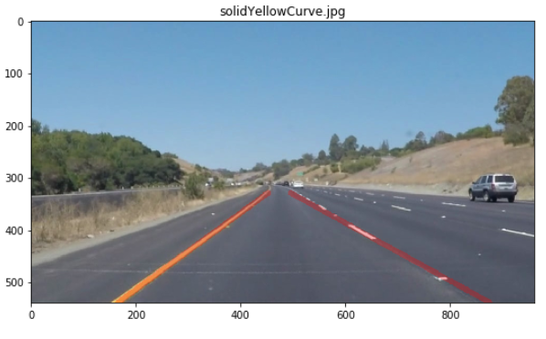

# **Finding Lane Lines on the Road**
## Project 1 for Udacity's Self-Driving Car NanoDegree

Overview
---

When we drive, we use our eyes to decide where to go.  The lines on the road that show us where the lanes are act as our constant reference for where to steer the vehicle.  Naturally, one of the first things we would like to do in developing a self-driving car is to automatically detect lane lines using an algorithm. Recognizing lanes on roads can be achieved using well known computer vision techniques. Some of those techniques will be covered below.

The first project of the [Udacity Self Driving Car Engineer Nanodegree](https://www.udacity.com/course/self-driving-car-engineer-nanodegree--nd013) is to create a pipeline that finds lane lines on the road.

Problem
---

We have a set of images to test the pipeline. Here's a sample image

Pipeline
---
    * Convert image to HSL
    * Isolate yellow and white regions from image
    * Grayscale
    * Gaussian Blur
    * Canny Edge Detection
    * Clipping Region Of Interest
    * Hough Transform
    * Separate left and right lanes
    * Extrapolate them to create two smooth lines
    
Step 1: Convert to HSL
---
Visualising the current RGB image in the HSL color space helps us isolate the lanes better H stands for Hue, S stands for saturation and L stands for Lightness, is not the same as Brightness/Value. Brightness is perceived as the "amount of light" which can be any color while Lightness is best understood as the amount of white.

Step 2: Extracting Yellow and White from the image
---

You can see yellow extracted from the image in the 2nd column and white in the 3rd column. Let's now combine those two masks using an OR operation and then combine with the original image using an AND operation to only retain the intersecting elements.

Step 3: Converting to Grayscale
---
Anything that is much brighter on the road will come out with a high contrast in a grayscale image

On the left is the grayscale of the original image and on the right is the grayscale of the HSL image

Step 4: Apply Gaussian Blur
---

Higher the kernel size higher is the amount of blur

Step 5: Canny Edge Detection
---
As the name suggests it detects edges in the image and discards rest of the information

Step 6: Clipping Region of Interest
---

Step 7: Applying Hough Transform
---
Hough Transform finds lines by tracing points that lie on them. It achieves that by transforming cartesian space (x,y) to hough space (m,b)

Step 8: Differentiating Left and Right Lanes
---

Step 9: Extrapolating the straight lines
---
We perform linear regression to find a straight line for both the lanes

## Video Output

